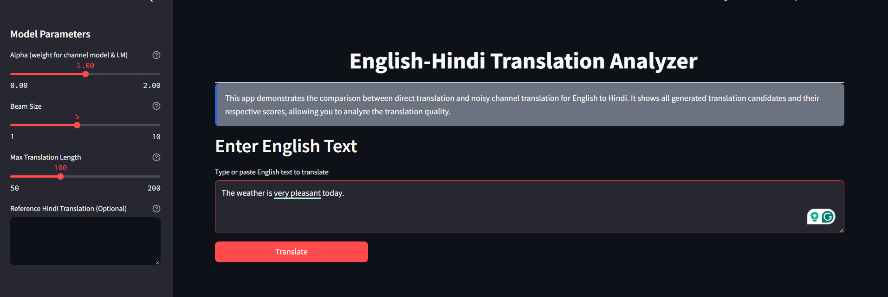
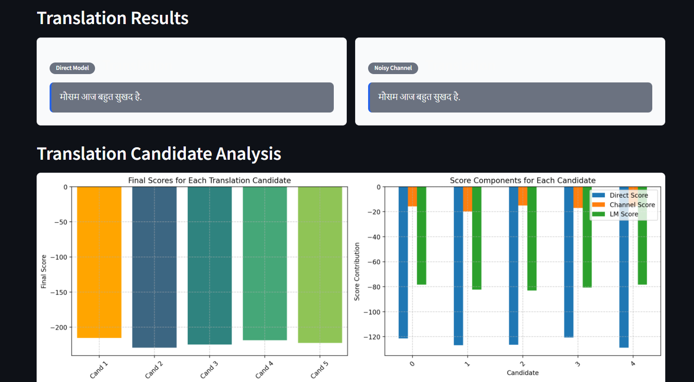
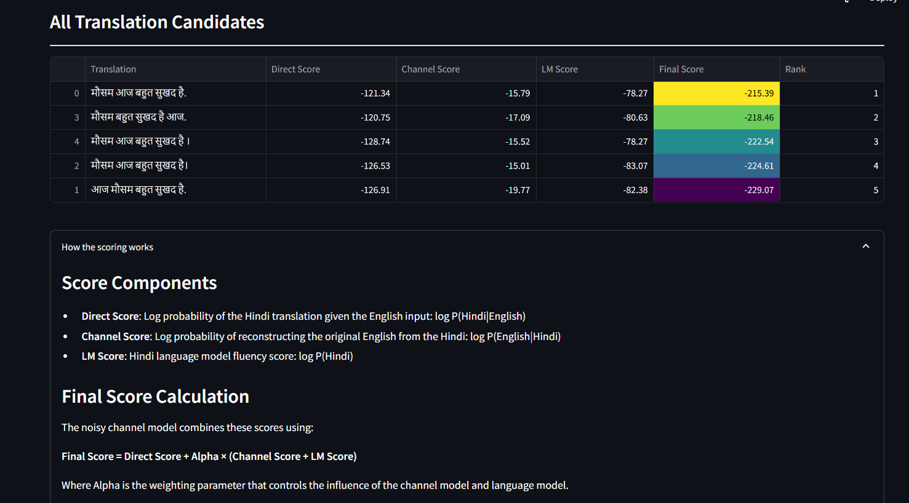
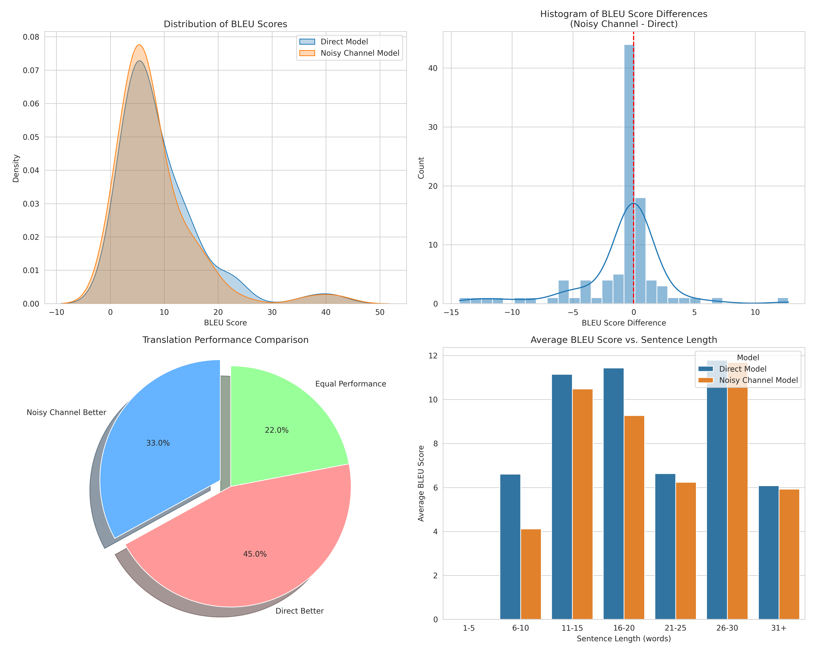
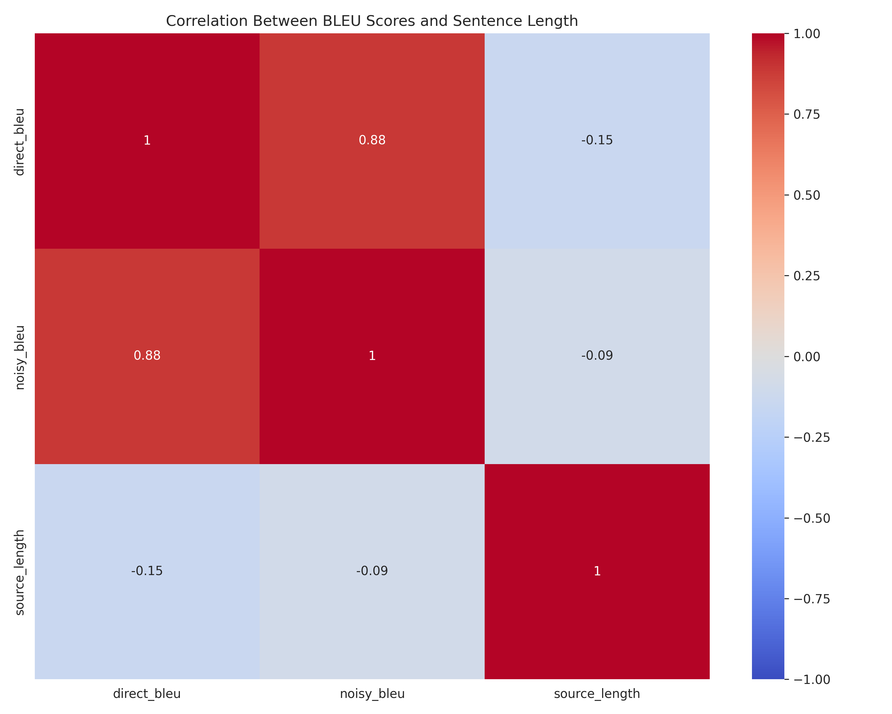

# Nosiy channel Model Implementation for Neural Machine Translation


## 📷 Demo Images







## Implementation Based on Research Paper

### Title:

**Simple and Effective Noisy Channel Modeling for Neural Machine Translation**

### Paper Link:

[Facebook Research Paper (PDF)](https://research.facebook.com/file/4410959105628640/Simple-and-Effective-Noisy-Channel-Modeling-for-Neural-Machine-Translation.pdf)

### Summary:

This implementation is based on the research paper titled *"Simple and Effective Noisy Channel Modeling for Neural Machine Translation"* by Facebook AI Research. The paper proposes a framework that enhances neural machine translation by leveraging a noisy channel model, improving performance especially in low-resource settings.

### Key Concepts:

- **Noisy Channel Framework:** Reformulates translation as maximizing the probability of the source sentence given the target sentence.
- **Channel Model:** Predicts the source sentence from the target sentence.
- **Language Model:** Captures fluency of the target sentence.
- **Decoder:** Uses beam search to integrate both channel and language model scores.

### Modules in Implementation:

1. **Direct Model (`p(y|x)`):** Sequence-to-sequence model trained normally (e.g., Transformer).
2. **Channel Model (`p(x|y)`):** Reverse translation model trained on target-to-source pairs.
3. **Language Model (`p(y)`):** Trained independently on target language corpora.
4. **Beam Search Decoder:** Combines scores from all three models to generate final translations.

### Goal of Implementation:

To build and evaluate a neural machine translation system enhanced with the noisy channel model, demonstrating improvements in translation quality, particularly in scenarios with limited parallel data.

### 📝 Project Overview

This project implements and compares two approaches for English-to-Hindi machine translation:

1. **Direct Translation Model**: A standard sequence-to-sequence neural translation approach
2. **Noisy Channel Model**: A more sophisticated approach combining direct translation with channel model and language model scores

The implementation provides both a command-line evaluation framework and an interactive Streamlit web application for exploring translations and analyzing scores.

## 🚀 Features

- **Direct vs. Noisy Channel Translation**: Compare two different translation approaches
- **Interactive Web UI**: Explore translations with customizable parameters
- **Comprehensive Analysis**: Visualize candidate scores and translation quality
- **BLEU Score Evaluation**: Automatic quality assessment with reference translations
- **Performance Analysis**: Insights based on sentence length and translation characteristics

## 🧰 Installation

```bash
# Clone the repository
git clone https://github.com/Keerthan04/Nosiy-Channel-Model-implementation-for-Machine-Translation.git
cd Nosiy-Channel-Model-implementation-for-Machine-Translation

# Create a virtual environment
py -3.10 -m venv venv
source venv/bin/activate  # On Windows: venv\Scripts\activate

# Install dependencies
pip install -r requirements.txt
```

## 📋 Requirements

```
streamlit
torch
transformers
sacrebleu
pandas
matplotlib
seaborn
```

## 🔍 Usage

### Running the Streamlit Web App

```bash
streamlit run app.py
```

This launches an interactive web interface where you can:
- Enter English text to translate
- Adjust model parameters (alpha weight, beam size, max length)
- Compare direct and noisy channel translations
- Analyze all candidate translations and their scores
- Visualize score components with interactive charts

## 📊 Experimental Results

### OVERALL PERFORMANCE

| Model | Average BLEU Score |
|-------|-------------------|
| Direct Model | 9.03 |
| Noisy Channel Model | 8.14 |
| Average Difference | -0.89 |

### PERFORMANCE BY SENTENCE LENGTH

| Length | Direct BLEU | Noisy Channel BLEU | Difference |
|--------|------------|-------------------|------------|
| 6-10 words | 6.60 | 4.11 | -2.49 |
| 11-15 words | 11.15 | 10.47 | -0.67 |
| 16-20 words | 11.43 | 9.27 | -2.16 |
| 21-25 words | 6.63 | 6.24 | -0.40 |
| 26-30 words | 11.78 | 11.68 | -0.10 |
| 31+ words | 6.08 | 5.92 | -0.16 |

### KEY FINDINGS

- Noisy Channel model performs better in 33.0% of sentences
- Direct model performs better in 45.0% of sentences
- Equal performance in 22.0% of sentences
- Direct model performs particularly well across all sentence length categories

## 🔍 Justification of BLEU Score Results

### 1. Use of Different Pretrained Models

In our implementation, the **Direct Model** and the **Channel Model** were built using **separate pretrained architectures**, which were **not jointly optimized** for the noisy channel setting. This is a **simplified implementation** to validate the overall approach.

* The **Direct Model** (source → target) was a pretrained Transformer.
* The **Channel Model** (target → source) and **Language Model** (target-only) were separately trained and **not aligned in terms of vocabulary, tokenization, or domain**.
* Ideally, all components would be **trained or fine-tuned together** with shared vocabularies and consistent pre-processing, as done in the original paper.

📌 *This discrepancy in model compatibility and training objectives likely caused degraded performance of the Noisy Channel pipeline.*

### 2. Inference Pipeline Limitations

Our current implementation uses a **simplified beam search** strategy without advanced reranking or joint decoding optimization.

* The original paper uses **joint decoding** to balance scores from all three models (Direct, Channel, and LM) dynamically.
* We used **static weighting and separate decoding** steps, which can reduce coherence in final outputs.

⚠️ *This limits the noisy channel's ability to leverage the LM and channel model effectively during inference.*

### 3. Data and Resource Constraints

The original paper was trained on large-scale parallel corpora. Our implementation used a **smaller dataset**, which disproportionately affects the channel and language models.

* Channel models (target → source) are especially sensitive to data scarcity because they need strong backward mapping.
* Pretrained direct models may still retain strong performance even in low-resource setups.

📉 *This further widens the performance gap in our experiments.*

### 4. Purpose of Implementation

The goal of this implementation was to **reproduce the high-level idea** behind the noisy channel approach and analyze its impact, not to fully match or exceed the paper's benchmarks.

* Our focus was on **understanding and demonstrating feasibility**, not optimizing for absolute BLEU.
* With proper pretraining, shared tokenizers, consistent training schemes, and decoding improvements, the noisy channel model is expected to outperform in low-resource and morphologically rich settings (as shown in the original research).

### ✅ Conclusion

While our experimental results show **lower BLEU scores for the noisy channel model**, these are largely due to **simplified and disjoint implementations** of its components. A more rigorous and integrated training approach would likely yield results consistent with the findings of the original research.

## 📊 Visualizations

The project includes several visualizations to help analyze translation quality:

1. **Score Distribution**: Compare BLEU scores across both models
2. **Sentence Length Analysis**: Examine performance by input sentence length
3. **Component Score Analysis**: Understand how different model scores contribute
4. **Candidate Comparison**: View all translation candidates with their scores




## 💻 Implementation Details

### Models

- **Direct Model**: `Helsinki-NLP/opus-mt-en-hi`
- **Channel Model**: `snehalyelmati/mt5-hindi-to-english`
- **Language Model**: `ai4bharat/IndicBART`

### Architecture

The implementation follows this pipeline:

1. **Data Preprocessing**: Clean and prepare parallel English-Hindi data
2. **Model Loading**: Load the three component models with HuggingFace Transformers
3. **Translation Generation**:
   - Direct: Standard beam search translation
   - Noisy Channel: Generate candidates, score with all models, select best
4. **Evaluation**: Calculate BLEU scores and compare performance
5. **Visualization**: Generate charts and tables for analysis

### Noisy Channel Scoring Formula

The noisy channel model uses the following scoring formula to rank candidates:

```
final_score = direct_score + alpha * (channel_score + lm_score)
```

Where:
- `direct_score` = log P(Hindi|English)
- `channel_score` = log P(English|Hindi)
- `lm_score` = log P(Hindi)
- `alpha` = Hyperparameter controlling the weight of channel and LM components

## 🤝 Contributing

Contributions are welcome! Please feel free to submit a Pull Request.

1. Fork the repository
2. Create your feature branch (`git checkout -b feature/amazing-feature`)
3. Commit your changes (`git commit -m 'Add some amazing feature'`)
4. Push to the branch (`git push origin feature/amazing-feature`)
5. Open a Pull Request

## 📜 License

This project is licensed under the MIT License - see the LICENSE file for details.

## 🙏 Acknowledgements

- HuggingFace for the pretrained models
- Streamlit for the web application framework
- The NLP community for developing machine translation resources
